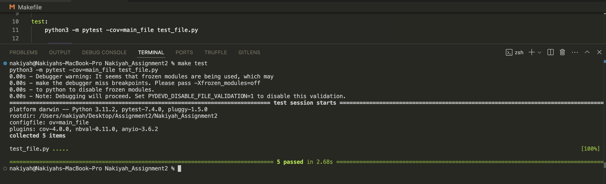
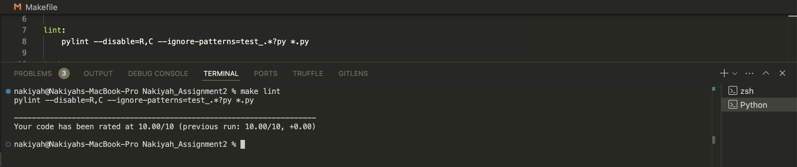
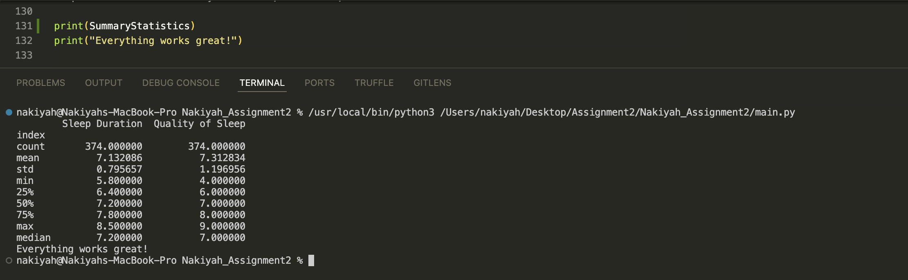
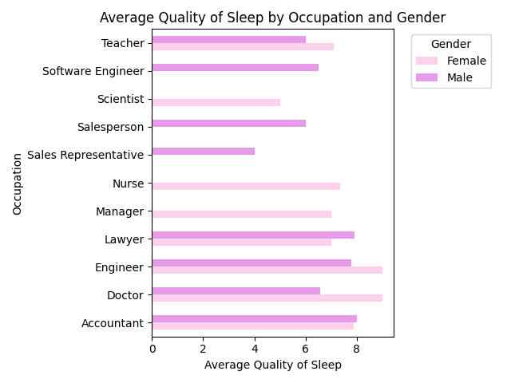

# Nakiyah_Assignment9

[](https://github.com/Nakiyah24/Nakiyah_Assignment9/actions/workflows/cicd.yml)

```
Nakiyah_Assignment9
├── .devcontainer/
│   ├── devcontainer.json
│   └── Dockerfile
├── .github/
│   └── workflows/
│       └── cicd.yml
├── .gitignore
├── Dockerfile
├── Nakiyah_Assignment9.ipynb
├── main.py
├── Makefile
├── README.md
├── requirements.txt
├── Sleep_health_and_lifestyle_dataset.csv
├── stack_plot.png
├── bar_plot.png
├── summary_statistics_report.pdf
└── test_file.py
```

## Repository contents:
1. .devcontainer directory (a) devcontainer.json (b) Dockerfile
2. .github/worflows/cicd.yml --> this is configuration file that defines the steps necessary to build, test, and deploy an application.
3. .gitignore --> to ensure some cache files like "pychache" do not get pushed to the github repo.
4. Makefile --> which sets rules to manage the dependencies of the source files of the programs during the compilation and linking (build) phase.
5. Requirements.txt --> contains a list of packages/libraries needed to work on this project that can all be installed with the file.
6. main.py --> Reads a CSV file, generates descriptive summary statistics, and produces data visualizations.
7. Nakiyah_Assignment9.ipynb --> Same content as main.py in a notebook format
7. test_file.py --> Tests the functionality of main.py by verifying the accuracy of the descriptive summary statistics and the correctness of the generated visualizations
### Run the main.py file to generate the pdf report and 2 visualizations

This guide will walk you through setting up a Google Colab notebook, writing code, and sharing your work with collaborators.

## Step 1: Access Google Colab
1. Open [Google Colab](https://colab.research.google.com) in your browser.
2. Sign in with your Google account, if needed.
3. Create a new notebook by selecting **File > New notebook**.


## Step 2: Write Code in Colab
1. Use code cells to write Python code. For example:
   ```python
   print("Hello, Data Science!")
   ```
2. Execute cells with the "Play" button or by pressing `Shift + Enter`.
3. Install and import necessary libraries (e.g., `numpy`, `pandas`, `matplotlib.pyplot`) with `!pip3 install` commands.


## Step 3: Collaborate and Share
1. In your Colab notebook, go to **File > Save a copy in GitHub**.
2. Select the appropriate GitHub repository and add a description of your changes.
3. Click **OK** to save the notebook directly to your GitHub repository.


## Step 4: Edit and Update through VSCode
1. Open VSCode and clone the repository with:
   ```bash
   git clone https://github.com/yourusername/your-repo-name.git
   ```
2. Make edits as needed to the notebook or other files in the cloned repository.
3. After making changes, save the files, stage them, and commit your changes in VSCode:
   - **Stage Changes**: Go to the **Source Control** panel, click **+** next to the files.
   - **Commit Changes**: Enter a commit message and click the checkmark icon.
4. Push the updates to GitHub


## Example Repository Integration
1. Include the Colab link in your repo's README under "Setup Instructions" or "Notebook Access."
2. Direct team members to the README for Colab setup and collaboration.


## Functions inside the main.py
- readData(): Reads the input CSV file and loads the data into a pandas DataFrame.
- cleanData(): Cleans the dataset by removing duplicates and selecting relevant columns.
- summaryStatistics(): Generates summary statistics, including the median, for the selected data.
- stackPlot(): Creates a stacked bar plot based on the provided x and stack values.
- barPlot(): Generates a horizontal bar plot, displaying the average of a variable segregated by another variable.
- writeToPDF(): Combines the summary statistics and generated plots into a PDF report.


## Testing Make Files
### Make Lint


### Make Test



## Printing Summary Statistics



## Data Visualizations
### Stack Plot


### Bar Plot
