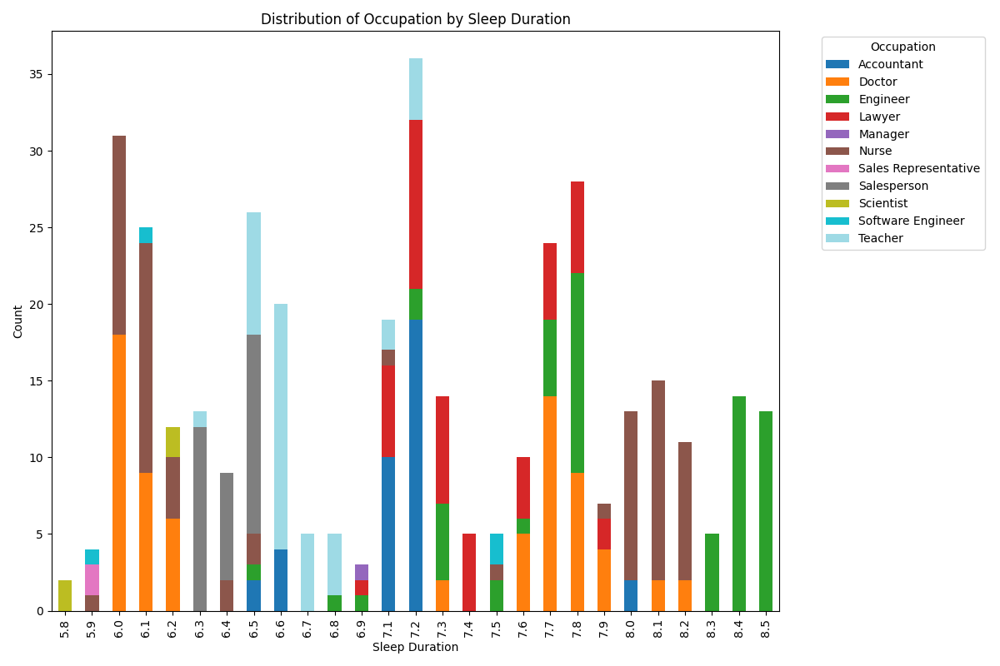

# Nakiyah_Assignment9

[](https://github.com/Nakiyah24/Nakiyah_Assignment9/actions/workflows/cicd.yml)

```
Nakiyah_Assignment9
├── .devcontainer/
│   ├── devcontainer.json
│   └── Dockerfile
├── .github/
│   └── workflows/
│       └── cicd.yml
├── .gitignore
├── Dockerfile
├── Nakiyah_Assignment9.ipynb
├── main.py
├── Makefile
├── README.md
├── requirements.txt
├── Sleep_health_and_lifestyle_dataset.csv
├── stack_plot.png
├── bar_plot.png
├── summary_statistics_report.pdf
└── test_file.py
```

## Repository contents:
1. .devcontainer directory (a) devcontainer.json (b) Dockerfile
2. .github/worflows/cicd.yml --> this is configuration file that defines the steps necessary to build, test, and deploy an application.
3. .gitignore --> to ensure some cache files like "pychache" do not get pushed to the github repo.
4. Makefile --> which sets rules to manage the dependencies of the source files of the programs during the compilation and linking (build) phase.
5. Requirements.txt --> contains a list of packages/libraries needed to work on this project that can all be installed with the file.
6. main.py --> Reads a CSV file, generates descriptive summary statistics, and produces data visualizations.
7. Nakiyah_Assignment9.ipynb --> Same content as main.py in a notebook format
7. test_file.py --> Tests the functionality of main.py by verifying the accuracy of the descriptive summary statistics and the correctness of the generated visualizations
### Run the main.py file to generate the pdf report and 2 visualizations


## Functions inside the main.py
- readData(): Reads the input CSV file and loads the data into a pandas DataFrame.
- cleanData(): Cleans the dataset by removing duplicates and selecting relevant columns.
- summaryStatistics(): Generates summary statistics, including the median, for the selected data.
- stackPlot(): Creates a stacked bar plot based on the provided x and stack values.
- barPlot(): Generates a horizontal bar plot, displaying the average of a variable segregated by another variable.
- writeToPDF(): Combines the summary statistics and generated plots into a PDF report.


## Testing Make Files
- Make Lint

### Make Test
- Make Test

## Data Visualizations
### Stack Plot


### Bar Plot


